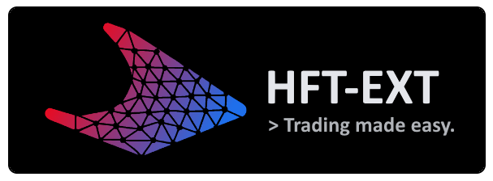

  
  []()
  [](https://discord.gg/HeqqWewjea)
  [](https://github.com/finned-digital-solutions/hft-ext/issues)

<br>

# HFT-EXT
> An extensible framework for high-frequency trading built on top of [Alpaca](https://alpaca.markets/) and Yahoo Finance.


## Why should I use HFT-EXT?
HFT-EXT is a framework that allows you to build your own high-frequency trading strategies. It is built on top of [Alpaca](https://alpaca.markets/) and Yahoo Finance. It is designed to be extensible, so you can easily add your own strategies and indicators using Python. In addition to this, it is open-source, so you can contribute to the project and help make it better. As opposed to other high-frequency traders, HFT-EXT is built by individuals, for individuals, not be shady hedge funds looking to make a quick buck.


## I'm sold! How do I get started?
First, you need to install the framework. You can do this by running the following command in your terminal:
```bash
git clone "https://github.com/finned-digital-solutions/hft-ext.git"
```
Then, you need to install the dependencies. You can do this by running the following command in your terminal:
```bash
cd hft-ext
pip install -r requirements.txt
```
Finally, you need to add your API keys to the `config.example.py` file. Simply fill the `ALPACA_PUBLIC_KEY` and `ALPACA_SECRET_KEY` variables with your API keys. Then, rename the file to `config.py`. You can now run the framework by running the following command in your terminal:
```bash
python main.py
```


## How do I add my own strategies?
You can add your own strategies by adding a custom strategy to the `scripts/strategies.py` file. Strategies are defined as classes that inherit from the `Strategy` class. As such, they have several methods that need to be included in each strategy. These methods are:
- `_should_buy()`: Responsible for determining whether or not the strategy should buy a new position.
- `_should_sell()`: Responsible for determining whether or not the strategy should sell the current position.
  
It's also worth mentioning that the Strategy class name is important. For example, to implement a new ETS strategy class, the name of the strategy class must be `ETSStrategy`. This is because the framework uses the name of the strategy class to determine which strategy to run.

Finally, to use your custom strategy in production, you need to add the strategy name to the `config.py` within the `MODEL` variable. For example, if you want to use the ETS strategy, you would add `MODEL = "ETS"` to the `config.py` file.

The default strategy used is the ARIMA strategy. You can find the code for this strategy in the `scripts/strategies.py` file, within the `ArimaStrategy` class.


## This is great, but I wish I could customize which tickers I want to trade. 
You can customize which tickers you want to trade by adding them to the `config.py` file. Simply add the tickers you want to trade to the `TRADE_TICKERS` variable. For example, if you want to trade Apple, Microsoft, and Tesla, you would add `TRADE_TICKERS = ["AAPL", "MSFT", "TSLA"]` to the `config.py` file. However, it is recommended that you use the default tickers, as they are the ones that have been tested and are known to work well with the framework.

As an aside, there are no limits to the number of tickers you can trade. However, the more tickers you trade, the more you risk running into API rate limits. If you do run into API rate limits, you can simply wait a few minutes and try again. If you want to avoid this, you can simply trade fewer tickers.


## I want to get to modifying the framework, but I don't know where to start.
No worries, it's pretty simple to get started. The framework is built on top of the [Alpaca](https://alpaca.markets/) and Yahoo Finance APIs. As such, you can find the documentation for these APIs [here](https://alpaca.markets/docs/api-documentation/api-v2/) and [here](https://pypi.org/project/yfinance/), respectively. An overview of the framework architecture can be found below.
<details>
  <summary>Show Framework Architecture</summary>
  <pre>
|--+ hft-ext
   |--+ images: Contains images used in the README.md file.
   |--+ scripts: Contains the source code for the framework.
   |  |--+ finned-theme.json: Theme for the GUI using CustomTkinter.
   |  |--+ gui.py: Contains the GUI code.
   |  |--+ strategy.py: Contains the Strategy class and any custom strategies.
   |  |--+ trader.py: Contains the Trader class, and is responsible for trading/portfolio management.
   |--+ utils: Contains utility functions used throughout the framework.
   |  |--+ utils.py: Contains utility functions related to sqlite3.
   |  |--+ notifier.py: Contains the Notifier class, which is responsible for sending update messages between threads (e.g., GUI and Trader).
   |--+ config.py: Contains the configuration variables for the framework.
   |--+ CONTRIBUTING.md
   |--+ LICENSE
   |--+ README.md
   |--+ requirements.txt
   |--+ .gitignore
   |--+ main.py: The main entry point for the framework which calls the GUI and Trader classes.
   </pre>
</details>

If you want to share your custom strategies or implementations with the community, please feel free to open a pull request. To learn more about how to contribute, please read the [CONTRIBUTING.md](CONTRIBUTING.md) file.


## I want to contribute!
That's great! We are always looking for new contributors. If you want to contribute, please read the [CONTRIBUTING.md](CONTRIBUTING.md) file. If you have any questions, please feel free to open an issue or contact us on [Discord](https://discord.gg/HeqqWewjea).


