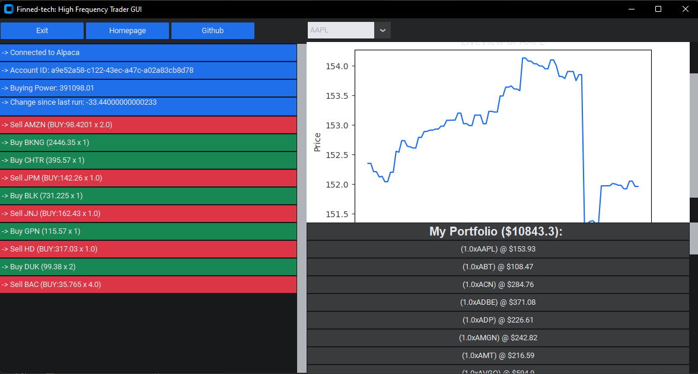
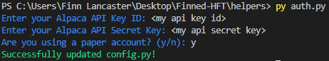
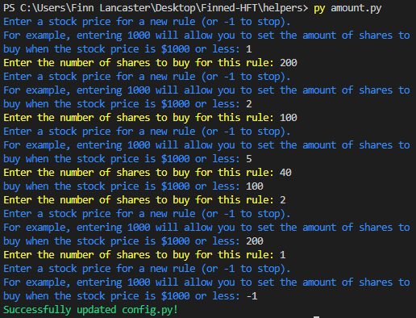
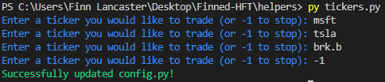

<p align="center">
  
</p>

  []()
  [](https://discord.gg/HeqqWewjea)
  [](https://github.com/finned-digital-solutions/hft-ext/issues)
  [](https://github.com/finned-digital-solutions/hft-ext/network)
  [](https://github.com/finned-digital-solutions/hft-ext/stargazers)
  [](https://www.paypal.com/paypalme/flancast90)

<br>

# HFT-EXT
> An extensible framework for high-frequency trading built on top of [Alpaca](https://alpaca.markets/) and Yahoo Finance.

## Table of Contents
- [HFT-EXT](#hft-ext)
  - [Table of Contents](#table-of-contents)
  - [Disclaimer](#disclaimer)
  - [Why should I use HFT-EXT?](#why-should-i-use-hft-ext)
  - [I'm sold! How do I get started?](#im-sold-how-do-i-get-started)
  - [I have a working strategy! How do I deploy it to live trading?](#i-have-a-working-strategy-how-do-i-deploy-it-to-live-trading)
  - [How do I add my own strategies?](#how-do-i-add-my-own-strategies)
  - [What about if I want to change the amount of shares I buy for each pricepoint?](#what-about-if-i-want-to-change-the-amount-of-shares-i-buy-for-each-pricepoint)
  - [This is great, but I wish I could customize which tickers I want to trade.](#this-is-great-but-i-wish-i-could-customize-which-tickers-i-want-to-trade)
  - [I want to get to modifying the framework, but I don't know where to start.](#i-want-to-get-to-modifying-the-framework-but-i-dont-know-where-to-start)
  - [I want to contribute!](#i-want-to-contribute)


## Disclaimer
_It goes without saying that past performance is not indicative of future results. This framework is not intended to be used for live trading. If you do use it for live trading, you do so at your own risk. The authors of this framework are not responsible for any losses incurred by using this framework. Please use this framework responsibly._

## Why should I use HFT-EXT?
HFT-EXT is a framework that allows you to build your own high-frequency trading strategies. It is built on top of [Alpaca](https://alpaca.markets/) and Yahoo Finance. It is designed to be extensible, so you can easily add your own strategies and indicators using Python. In addition to this, it is open-source, so you can contribute to the project and help make it better. It is designed to be compatible with both paper and live trading accounts, and is designed to be easy to use, so you can get started trading in no time.




## I'm sold! How do I get started?
_To get started, ensure you have Python 3.8 or higher installed. You can download Python [here](https://www.python.org/downloads/). Also, you must make a (free) account with Alpaca. You can do this [here](https://app.alpaca.markets/signup). This account will be used to make paper or live trades, and to retrieve information on your portfolio. You will also need to create an API public and secret key for your account. You can do this [here](https://app.alpaca.markets/paper/dashboard/overview). Make sure you save your API key and secret key somewhere safe. You will need them later._

First, you need to install the framework. You can do this by running the following command in your terminal:
```bash
git clone "https://github.com/finned-digital-solutions/hft-ext.git"
```
Then, you need to install the dependencies. You can do this by running the following command in your terminal:
```bash
cd hft-ext
pip install -r requirements.txt
```
Finally, you need to add your Alpaca API keys to the `config.py` file. We have a built-in script that will help you do this. You can run this script by running the following command in your terminal:
```bash
cd helpers
python auth.py
```
The script should look like this:




From there, make sure you are back in the root directory ``cd ..`` and run the following command in your terminal:
```bash
python main.py
```

## I have a working strategy! How do I deploy it to live trading?
You can deploy your strategy by changing the `Paper` variable to `False` in the `config.py` file. Please note that you will need to have a live trading account with Alpaca to do this. You can find more information about Alpaca's live trading accounts [here](https://alpaca.markets/docs/trading/account-plans/).


## How do I add my own strategies?
You can add your own strategies by adding a custom strategy to the `scripts/strategies.py` file. Strategies are defined as classes that inherit from the `Strategy` class. As such, they have several methods that need to be included in each strategy. These methods are:
- `_should_buy()`: Responsible for determining whether or not the strategy should buy a new position.
- `_should_sell()`: Responsible for determining whether or not the strategy should sell the current position.

Since they inherit from the `Strategy` class, make sure to include `Strategy` in the class definition. For example, if you want to create a strategy called `MyCustomStrategyName`, you would want to define it as follows:
```python
class MyCustomStrategyName(Strategy):
  def _should_buy(self, past_prices:list) -> bool:
    ...
  def _should_sell(self, bought_price:float, current_price:float, past_prices:list) -> bool:
    ...
```
  
To then use your custom strategy, you have to instantiate it within `scripts/strategies.py`. This is done by adding the following line to the end of the file:
```python
strategy = Strategy(MyCustomStrategyName())
```
Where `MyCustomStrategyName` is the name of your custom strategy class. Currently, the model used is `ArimaStrategy`, which is an ARIMA model that uses the previous day of data to predict the next day's fluctuations. you can see it instantiated in the `scripts/strategies.py` file as follows:
```python
strategy = Strategy(ArimaStrategy())
```

The default strategy used is the ARIMA strategy. You can find the code for this strategy in the `scripts/strategies.py` file, within the `ArimaStrategy` class.


## What about if I want to change the amount of shares I buy for each pricepoint?
By default, the model will buy a total of $200 worth of shares for each pricepoint. We recognize that this may be a bit too much for some people, so we have made it easy to change this. You can run the following command in your terminal to change the amount of shares you buy for each pricepoint:
```bash
cd helpers
python amount.py
```
The script should look like this:



Which is also the default setting.


## This is great, but I wish I could customize which tickers I want to trade. 
You can customize which tickers you want to trade by adding them to the `config.py` file. We have a built-in script that will help you do this. You can run this script by running the following command in your terminal:
```bash
cd helpers
python tickers.py
```
The script should look like this:



As an aside, there are no limits to the number of tickers you can trade. However, the more tickers you trade, the more you risk running into API rate limits. If you do run into API rate limits, you can simply wait a few minutes and try again. If you want to avoid this, you can simply trade fewer tickers.


## I want to get to modifying the framework, but I don't know where to start.
No worries, it's pretty simple to get started. The framework is built on top of the [Alpaca](https://alpaca.markets/) and Yahoo Finance APIs. As such, you can find the documentation for these APIs [here](https://alpaca.markets/docs/api-documentation/api-v2/) and [here](https://pypi.org/project/yfinance/), respectively. An overview of the framework architecture can be found below.
<details>
  <summary>Show Framework Architecture</summary>
  <pre>
|--+ hft-ext
   |--+ images: Contains images used in the README.md file.
   |--+ scripts: Contains the source code for the framework.
   |  |--+ finned-theme.json: Theme for the GUI using CustomTkinter.
   |  |--+ gui.py: Contains the GUI code.
   |  |--+ strategy.py: Contains the Strategy class and any custom strategies.
   |  |--+ trader.py: Contains the Trader class, and is responsible for trading/portfolio management.
   |--+ utils: Contains utility functions used throughout the framework.
   |  |--+ utils.py: Contains utility functions related to sqlite3.
   |  |--+ notifier.py: Contains the Notifier class, which is responsible for sending update messages between threads (e.g., GUI and Trader).
   |--+ helpers: Contains helper scripts for the framework.
   |  |--+ auth.py: Script for adding API keys to the config.py file.
   |  |--+ amount.py: Script for changing the amount of shares bought for each pricepoint.
   |  |--+ tickers.py: Script for adding tickers to the config.py file.
   |--+ config.py: Contains the configuration variables for the framework.
   |--+ CONTRIBUTING.md
   |--+ LICENSE
   |--+ README.md
   |--+ requirements.txt
   |--+ .gitignore
   |--+ main.py: The main entry point for the framework which calls the GUI and Trader classes.
   </pre>
</details>

If you want to share your custom strategies or implementations with the community, please feel free to open a pull request. To learn more about how to contribute, please read the [CONTRIBUTING.md](CONTRIBUTING.md) file.


## I want to contribute!
That's great! We are always looking for new contributors. If you want to contribute, please read the [CONTRIBUTING.md](CONTRIBUTING.md) file. If you have any questions, please feel free to open an issue or contact us on [Discord](https://discord.gg/HeqqWewjea).


